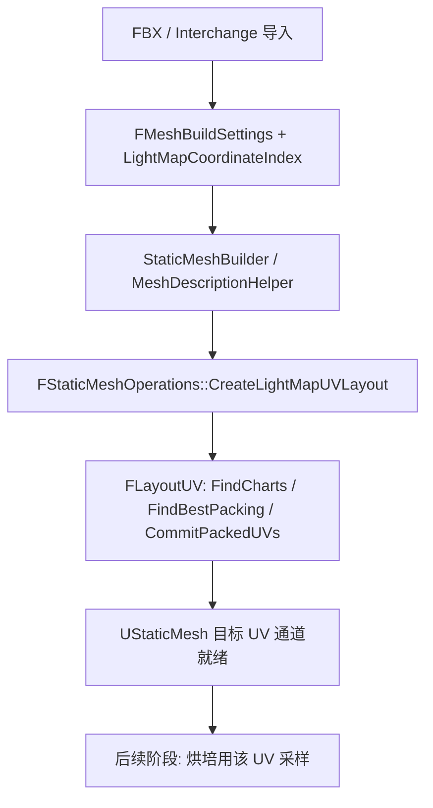

# Phase 1 阅读指南

目标：弄清 UE 5.4 在**导入 / 构建 StaticMesh** 时，如何决定是否生成 Lightmap UV、用哪条源/目标 UV 通道，以及 `FLayoutUV` 如何把 chart 打包进目标通道。

本指南配合 [READ_LIST.md](./READ_LIST.md) 使用；代码路径均相对 `Core/Phase1/`。

---

## 1. 阶段在整条管线中的位置



阶段 1 **不**求解光照；只保证网格上存在可用的 Lightmap UV 布局，并把「用哪一通道」记在资产上。

---

## 2. 三条概念线

### A. 设置线

| 字段 | 含义 | 默认印象 |
|------|------|----------|
| `bGenerateLightmapUVs` | 构建时是否自动生成 LM UV | FBX 导入数据默认常为 true；Interchange Pipeline 默认常为 false |
| `SrcLightmapIndex` | Chart 划分依据的源 UV 通道 | 0 |
| `DstLightmapIndex` | 写入生成结果的目标 UV 通道 | 1 |
| `MinLightmapResolution` | 打包时参考的最小分辨率 | 64（见 `FMeshBuildSettings`） |
| `UStaticMesh::LightMapCoordinateIndex` | 烘培/运行时认为「Lightmap UV」在哪一通道 | 常与 `DstLightmapIndex` 对齐 |
| `UStaticMesh::LightmapUVVersion` | 选用哪套 `ELightmapUVVersion` 算法 | 与 `ELightmapUVVersion::Latest` 演进相关 |

**先读：** `EngineTypes.h`（`FMeshBuildSettings`）→ `StaticMesh.h`（坐标索引 / 版本）→ `MeshUtilitiesCommon.h`（`ELightmapUVVersion`）。

### B. 调用线

现代路径：

1. 导入把上述字段写进 `UStaticMesh` 的 LOD `BuildSettings`（和/或 `LightMapCoordinateIndex`）
2. `FStaticMeshBuilder` 构建 LOD 时构造 `FMeshDescriptionHelper`
3. `SetupRenderMeshDescription` 里若 `bGenerateLightmapUVs`，调用  
   `FStaticMeshOperations::CreateLightMapUVLayout(...)`
4. 内部用 `FLayoutUVMeshDescriptionView` 适配 `FLayoutUV::IMeshView`，再跑 chart + packing

旧路径（对照）：`MeshUtilities.cpp` 里 `FLayoutUVRawMeshView` + 直接 `FLayoutUV`，逻辑同构，网格表示不同。

### C. 算法线

```
OverlappingCorners（重合顶点）
  → FLayoutUV::FindCharts     // 按源 UV / 几何切分 chart
  → FLayoutUV::FindBestPacking // 在分辨率约束下 2D 装箱（Allocator2D）
  → FLayoutUV::CommitPackedUVs // 写回目标 UV
```

`CreateLightMapUVLayout` 还会按 `ELightmapUVVersion`（如 `ForceLightmapPadding`）调整有效分辨率后再 packing。

---

## 3. 阅读顺序

### Session 1 — 契约

1. `EngineTypes.h` → 搜 `FMeshBuildSettings`、`bGenerateLightmapUVs`
2. `StaticMesh.h` → `LightMapCoordinateIndex`、`LightMapResolution`、`GetLightmapUVVersion`
3. `MeshUtilitiesCommon.h` → 通读 `ELightmapUVVersion` 枚举（每个值名即一次算法修复/改进）

**检查点：** 能口述「源通道 / 目标通道 / 坐标索引」三者关系，以及「不生成 UV 时」系统仍可用已有通道。

### Session 2 — 构建入口

1. `MeshDescriptionHelper.cpp`：`bGenerateLightmapUVs` 分支（扩 UV 通道数 → `CreateLightMapUVLayout`）
2. `StaticMeshBuilder.cpp`：搜 `MeshDescriptionHelper` / `SetupRenderMeshDescription`，看构建流程何时进来
3. `StaticMeshOperations.h` 声明 → `StaticMeshOperations.cpp` 的 `CreateLightMapUVLayout` 整函数

**检查点：** 画出「Builder → Helper → CreateLightMapUVLayout → FLayoutUV」四层调用；标出 `Src/Dst/MinResolution/Version/OverlappingCorners` 参数来源。

### Session 3 — LayoutUV 算法

1. `LayoutUV.h`：`IMeshView`、`FMeshChart`、三个公开步骤 API
2. `LayoutUV.cpp`：先跟 `FindCharts` / `FindBestPacking` / `CommitPackedUVs` 主路径，再按需下钻 `FChartFinder` / `FChartPacker`
3. `OverlappingCorners.*`：为何 chart 边界依赖「重合角点」
4. `Allocator2D.*`：packing 如何在 2D 上占位；与 `ELightmapUVVersion` 的关系

**检查点：** 能说明 chart 的 UV 范围如何变成 atlas 内的 `PackingScale/Bias`；padding / SmallChart / ScaleByEdgesLength 各自影响哪一步。

### Session 4 — 导入如何灌设置

**FBX：**

- `FbxStaticMeshImportData.h/.cpp`：导入选项默认值
- `FbxStaticMeshImport.cpp`：  
  - 命名 Light UV → `SetLightMapCoordinateIndex`  
  - `bGenerateLightmapUVs` 时设置 `DstLightmapIndex` / `LightMapCoordinateIndex`

**Interchange：**

- `InterchangeGenericMeshPipeline.h`：Pipeline 属性
- `InterchangeGenericStaticMeshPipeline.cpp`：写入 FactoryNode
- `InterchangeStaticMeshFactoryNode.*`：`ApplyCustomGenerateLightmapUVsToAsset` 等如何落到 `BuildSettings`

**检查点：** 对比 FBX「默认生成」vs Interchange「Pipeline 默认不生成」；二者最终是否都落到同一套 `FMeshBuildSettings`。

### Session 5 — 对照旧路径

- `MeshUtilities.cpp`：只读 `FLayoutUVRawMeshView` 与 `bGenerateLightmapUVs` 包一段
- 与 `FLayoutUVMeshDescriptionView` 对比：同一 `FLayoutUV`，不同 `IMeshView` 实现

---

## 4. 关键符号速查

| 符号 | 文件 | 作用 |
|------|------|------|
| `FMeshBuildSettings` | `EngineTypes.h` | 构建期 LM UV 开关与通道 |
| `ELightmapUVVersion` | `MeshUtilitiesCommon.h` | 展开算法版本 |
| `FLayoutUV` | `LayoutUV.h/.cpp` | Chart + Packing 核心 |
| `FLayoutUV::IMeshView` | `LayoutUV.h` | 与具体网格类型解耦 |
| `FOverlappingCorners` | `OverlappingCorners.*` | 顶点重合关系 |
| `FAllocator2D` | `Allocator2D.*` | 2D 装箱 |
| `CreateLightMapUVLayout` | `StaticMeshOperations.*` | MeshDescription 官方入口 |
| `FMeshDescriptionHelper` | `MeshDescriptionHelper.*` | 构建时触发入口 |
| `FStaticMeshBuilder` | `StaticMeshBuilder.*` | StaticMesh LOD 构建 |
| `LightMapCoordinateIndex` | `StaticMesh.h` | 资产级「LM 用哪路 UV」 |
| `bGenerateLightmapUVs` | FBX / Interchange / BuildSettings | 是否自动生成 |

---

## 5. 大文件阅读策略

| 文件 | 策略 |
|------|------|
| `LayoutUV.cpp` | 先三 API 主路径，再按 `ELightmapUVVersion` 分支对比差异 |
| `StaticMeshOperations.cpp` | 只精读 `CreateLightMapUVLayout` / `GetUVChartCount` / View 适配类 |
| `StaticMeshBuilder.cpp` | 搜 `MeshDescriptionHelper`，跟一条 LOD build |
| `MeshUtilities.cpp` | 只对照 RawMesh 段，勿通读 |
| `StaticMesh.cpp` / `StaticMesh.h` | 搜 LightMap / LightmapUV 符号；头文件以字段与 accessor 为主 |
| `FbxStaticMeshImport.cpp` | 搜 `LightMap` / `GenerateLightmap` / `DstLightmap` |
| `Interchange*Pipeline.cpp` | 搜 `GenerateLightmap` / `SrcLightmap` / `DstLightmap` |

---

## 6. 读完应能回答的问题

1. 关闭 `bGenerateLightmapUVs` 时，Lightmap 还能否烘焙？依赖什么？
2. `SrcLightmapIndex` 与 `LightMapCoordinateIndex` 何时不同？导入如何对齐 `Dst`？
3. `MinLightmapResolution` 与最终 lightmap 纹理分辨率是同一概念吗？
4. 为什么需要 `IMeshView`？MeshDescription 与 RawMesh 如何共享同一套 packing？
5. `ELightmapUVVersion::ForceLightmapPadding` 在 `CreateLightMapUVLayout` 里具体改了什么？

---

## 7. 与后续阶段的接口

阶段 1 交给后面阶段的「契约」主要是：

- 网格顶点上 **目标 UV 通道** 已布局（或导入已自带）
- `UStaticMesh::LightMapCoordinateIndex` 指向该通道
