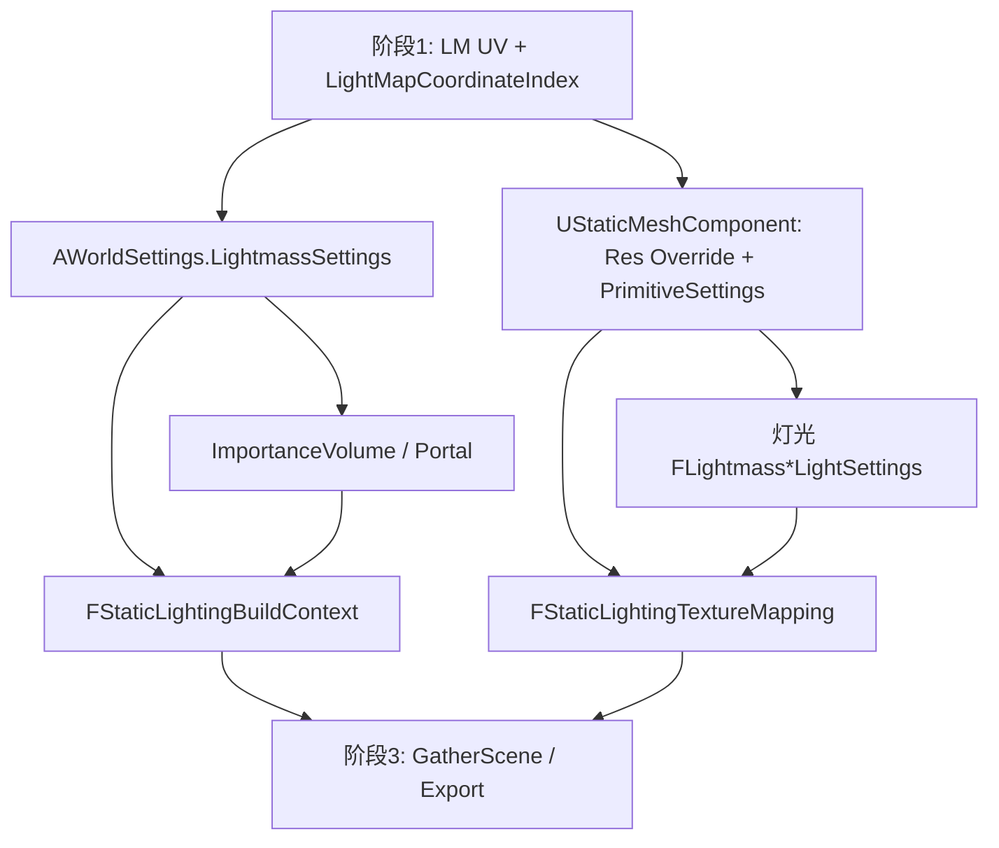

# Phase 2 阅读指南

目标：弄清 UE 5.4 在**正式收集场景做 Lightmass 之前**，烘培质量、场景范围、每物体分辨率 / Primitive 设置、灯光 Lightmass 参数分别存在哪里，以及它们如何汇聚成 `FStaticLightingTextureMapping`（Size + Lightmap UV Index）。

配合 [READ_LIST.md](./READ_LIST.md)；路径相对 `Core/Phase2/`。

---

## 1. 阶段在整条管线中的位置




阶段 2 配置「烘什么、烘多细、物体/灯怎么参与」，并把分辨率与 UV 通道编进静态光照 Mapping 抽象。

---


## 2. 四层参数


### A. 世界层 — `FLightmassWorldInfoSettings`

挂在 `AWorldSettings::LightmassSettings`，影响整次构建的求解行为与体积照明方式。


| 字段簇     | 代表项                                                                               | 作用直觉                                  |
| ------- | --------------------------------------------------------------------------------- | ------------------------------------- |
| 尺度 / 质量 | `StaticLightingLevelScale`、`IndirectLightingQuality`、`IndirectLightingSmoothness` | 尺度越大通常越快越糙；Quality>1 显著加时             |
| 反弹      | `NumIndirectLightingBounces`、`NumSkyLightingBounces`                              | 点/聚/平行 vs 天空/自发光的反弹次数                 |
| 环境      | `EnvironmentColor` / `EnvironmentIntensity`                                       | 旧式环境半球；注释建议优先 Static Skylight         |
| Boost   | `DiffuseBoost`、`EmissiveBoost`                                                    | 全场景材质贡献缩放                             |
| 体积照明    | `VolumeLightingMethod`、Volumetric* / `VolumeLightSamplePlacementScale`            | Volumetric Lightmap vs Sparse Samples |
| AO      | `bUseAmbientOcclusion` 及 Occlusion* 分数                                            | 烘进 lightmap / AO Mask                 |
| 输出      | `bCompressLightmaps`                                                              | 压缩 vs 4× 体积                           |


**先读：** `WorldSettings.h` 整段 `FLightmassWorldInfoSettings` → `WorldSettings.cpp` 的 Clamp / `CanEditChange`（看哪些字段随 Method/AO 显隐）。

### B. 范围层 — Volume / Portal / BuildContext


| 对象                                               | 作用                                                                |
| ------------------------------------------------ | ----------------------------------------------------------------- |
| `ALightmassImportanceVolume`                     | 框定 Lightmass「重点区域」；框外光子/采样变少                                      |
| `ALightmassPortal` + `ULightmassPortalComponent` | 引导间接光穿过门窗类开口                                                      |
| `FStaticLightingBuildContext`                    | 构建期上下文：`ImportanceBounds`、哪些 Level/Actor 纳入、MapBuildData Registry |


Importance Bounds 最终经 BuildContext 交给后续导出（阶段 3）；本阶段先搞清「谁提供边界、谁过滤 Actor」。

### C. 物体层 — 分辨率 + `FLightmassPrimitiveSettings`

**分辨率优先级（StaticMesh）：**

```
bOverrideLightMapRes == true  →  OverriddenLightMapRes
否则                          →  UStaticMesh::LightMapResolution
```

见 `UStaticMeshComponent::GetLightMapResolution`（约 2650 行）。Override 会对齐到 ≥4 且为 4 的倍数。

**Primitive 设置**（`FLightmassPrimitiveSettings`）：双面照明、仅投影间接影、自发光参与静态光、半球采样用法线、Emissive/DiffuseBoost、AO 相关 `FullyOccludedSamplesFraction` 等。  
可写在 Component 上，也可放进 `ULightmassPrimitiveSettingsObject` 复用。

**UV 通道**仍来自阶段 1 的 `UStaticMesh::LightMapCoordinateIndex`（本阶段不改展开算法）。

### D. 灯光层 — `FLightmass*LightSettings`

- 基类：`IndirectLightingSaturation`、`ShadowExponent`、`bUseAreaShadowsForStationaryLight`
- Directional 额外：`LightSourceAngle`（半影）
- 入口：`ULightComponent::GetLightmassSettings()`，Local / Directional 各自返回成员结构体

---


## 3. 阅读顺序


### Session 1 — 契约与世界设置

1. `EngineTypes.h`：`ELightingBuildQuality`、三类 `FLightmass*Settings`
2. `WorldSettings.h`：通读 `FLightmassWorldInfoSettings` 字段注释（官方注释质量很高）
3. `WorldSettings.cpp`：Clamp + AO/Volumetric 相关 `CanEditChange`

**检查点：** 能区分「构建质量枚举（Preview/Medium/…）」与「WorldInfo 里的 IndirectLightingQuality 浮点倍率」；能说出 Importance Volume 与 `VolumeLightingMethod` 各自管什么。

### Session 2 — 物体分辨率与 Primitive

1. `StaticMesh.h`：复习 `LightMapResolution` / `LightMapCoordinateIndex`
2. `StaticMeshComponent.h`：Override 字段 + `LightmassSettings` + 静态光照相关 API
3. `StaticMeshComponent.cpp`：精读 `GetLightMapResolution`、`HasValidSettingsForStaticLighting`
4. `LightmassPrimitiveSettingsObject.*`：对照 Component 内嵌同一结构体

**检查点：** 画出「资产分辨率 vs Component Override」决策；说明 `HasValidSettingsForStaticLighting` 至少检查了分辨率与（上层）静态光照资格。

### Session 3 — Volume / Portal / BuildContext

1. `LightmassImportanceVolume.*`、`LightmassPortal*` / `PortalComponent.cpp`
2. `StaticLightingBuildContext.h` 接口一览
3. `StaticLightingBuildContext.cpp`：`SetImportanceBounds`、`ShouldIncludeActor/Level`、Registry 获取

**检查点：** BuildContext 不「存一份完整设置拷贝」，而是持有 World/Scenario、ImportanceBounds、以及写回用的 MapBuildData 入口。

### Session 4 — 灯光设置 + 分辨率批处理工具

1. `LightComponent.h` → `LocalLightComponent.h` → `DirectionalLightComponent.h`
2. `LightmapResRatioAdjust.h/.cpp`：`ApplyRatioAdjustment` 如何读当前分辨率、乘 Ratio、写回 Override

**检查点：** 工具改的是 **Component/表面分辨率**，不是 `FLightmassWorldInfoSettings`；与 World Quality 正交。

### Session 5 — 汇入 Mapping（通向阶段 3）

1. `StaticLighting.h`：`FStaticLightingTextureMapping` 构造参数含义
2. `StaticMeshLight.cpp`：搜 `GetLightMapResolution`、`GetLightMapCoordinateIndex`、创建 Mapping 的几处分支（含 LOD）
3. 顺带看 `LightmassSettings.EmissiveBoost/DiffuseBoost` 如何从 Component 转发

**检查点：** 阶段 3 收集到的每个 Texture Mapping，至少已绑定 **SizeX/Y** 与 **LightmapTextureCoordinateIndex**；世界级质量设置则在导出 Scene 时另附（本 Phase 看到的是数据源，完整导出在阶段 3）。

---


## 4. 关键符号速查


| 符号                                               | 文件                             | 作用                              |
| ------------------------------------------------ | ------------------------------ | ------------------------------- |
| `FLightmassWorldInfoSettings`                    | `WorldSettings.h`              | 世界级烘培/体积/AO 参数                  |
| `EVolumeLightingMethod`                          | `WorldSettings.h`              | Volumetric LM vs Sparse Samples |
| `ELightingBuildQuality`                          | `EngineTypes.h`                | Preview/Medium/High/Production  |
| `FLightmassPrimitiveSettings`                    | `EngineTypes.h`                | 每 Primitive 的 Lightmass 行为      |
| `FLightmassLightSettings` 及派生                    | `EngineTypes.h`                | 每灯光间接饱和度、半影等                    |
| `bOverrideLightMapRes` / `OverriddenLightMapRes` | `StaticMeshComponent.*`        | 实例级 LM 分辨率                      |
| `GetLightMapResolution`                          | `StaticMeshComponent.cpp`      | 解析最终 Width/Height               |
| `ALightmassImportanceVolume`                     | `LightmassImportanceVolume.*`  | 重点烘培空间                          |
| `ALightmassPortal`                               | `LightmassPortal.*`            | 间接光入口引导                         |
| `FStaticLightingBuildContext`                    | `StaticLightingBuildContext.*` | 构建范围与写回上下文                      |
| `FStaticLightingTextureMapping`                  | `StaticLighting.h`             | Size + LM UV Index 的 Mapping    |
| `FStaticMeshStaticLighting*`                     | `StaticMeshLight.*`            | StaticMesh → Mesh/Mapping       |
| `FLightmapResRatioAdjustSettings`                | `LightmapResRatioAdjust.*`     | 编辑器批量改分辨率                       |


---


## 5. 大文件阅读策略


| 文件                           | 策略                                                         |
| ---------------------------- | ---------------------------------------------------------- |
| `EngineTypes.h`              | 只精读 Lightmass / LightingBuildQuality 段；勿通读                 |
| `WorldSettings.h`            | 精读 `FLightmassWorldInfoSettings`；其余 World 设置略过             |
| `WorldSettings.cpp`          | 搜 `LightmassSettings` 即可                                   |
| `StaticMeshComponent.cpp`    | 搜 `LightMap` / `Lightmass` / `StaticLighting`；主读 2650–2750 |
| `StaticMeshLight.cpp`        | 跟「创建 StaticLightingMesh/Mapping」主路径                        |
| `StaticLighting.h`           | 通读三个核心类接口，实现细节留待阶段 3                                       |
| `LightmapResRatioAdjust.cpp` | 通读 `ApplyRatioAdjustment` 一条路径                             |


---


## 6. 读完应能回答的问题

1. 同一张 StaticMesh 放两个实例，能否一个 64、一个 256 分辨率烘培？靠什么字段？
2. `MinLightmapResolution`（阶段 1 UV 打包）和 `LightMapResolution` / `OverriddenLightMapRes`（本阶段）分别影响什么？
3. 没有 Importance Volume 时，BuildContext 的 ImportanceBounds 大致会怎样？（结合后续阶段 3 的 Gather，本阶段先记下「Bounds 可从 Volume 来」）
4. `IndirectLightingQuality` 与 Lighting Build Quality 菜单是否同一回事？
5. Portal 会改变 lightmap 分辨率吗？还是只影响求解侧间接光传播？
6. `FStaticLightingTextureMapping` 构造时，Size 与 `LightmapTextureCoordinateIndex` 各从哪来？

---


## 7. 与前后阶段的接口

**来自阶段 1：**

- 目标 UV 通道已布局（或导入自带）
- `UStaticMesh::LightMapCoordinateIndex` 有效

**交给阶段 3：**

- 世界：`AWorldSettings::LightmassSettings`（质量、反弹、AO、体积方法…）
- 范围：Importance Bounds / Portal /「哪些 Actor 纳入」的规则入口（BuildContext）
- 每 Mapping：`SizeX/Y` + `LightmapTextureCoordinateIndex` + Primitive/Light 的 Lightmass 设置

阶段 3 再负责 `GatherScene` → Swarm/Lightmass 导出；本阶段把「可配置旋钮」与「Mapping 上已钉死的分辨率/UV」读清楚即可。