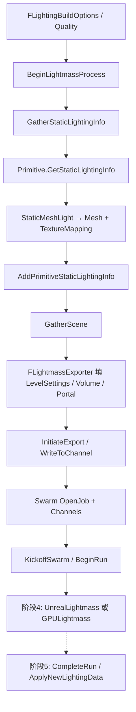

# Phase 3 阅读指南

目标：弄清编辑器如何**收集**可烘培对象、把阶段 2 的设置与 Mapping **装填**进 `FLightmassExporter`，再经 **Swarm** 把 scene/mesh/material/mapping **导出**给 UnrealLightmass（或走 GPULightmass 注册接口）。

配合 [READ_LIST.md](./READ_LIST.md)；路径相对 `Core/Phase3/`。

---

## 1. 阶段在整条管线中的位置

本阶段终点：**任务已提交、求解进程开始跑**。同文件里的 Import / Encode / Apply 留给阶段 5。

---

## 2. 三条概念线

### A. 收集线（Editor 内存图）

1. `FStaticLightingManager::CreateStaticLightingSystem` 创建 `FStaticLightingSystem`
2. `BeginLightmassProcess` 做启动清理后进入几何收集
3. `GatherStaticLightingInfo` 遍历 Level / Actor / Primitive：  
   `Primitive->GetStaticLightingInfo(...)` → 得到 `FStaticLightingPrimitiveInfo`（Meshes + Mappings）
4. `AddPrimitiveStaticLightingInfo` 把 Mesh/Mapping 挂进 System 的 `Meshes` / `Mappings`，并更新包围盒 / Importance 自动边界
5. BSP 等非 Component 路径在同文件内手写填充（对照阅读即可）

StaticMesh 侧核心实现：`StaticMeshLight.cpp`（分辨率 + `LightMapCoordinateIndex` → `FStaticLightingTextureMapping`）。

### B. 装填线（Exporter 配置）

`GatherScene`（约 2241）典型顺序：

| 步骤 | 动作 |
|------|------|
| LevelSettings | `WorldSettings->LightmassSettings` → `Exporter->SetLevelSettings` |
| Quality | `Options.QualityLevel` / `NumUnusedLocalCores` |
| Importance | 遍历 `ALightmassImportanceVolume`；WP 世界则用 VLM GridBounds |
| Detail / Portal / Sky | CharacterIndirectDetail、Portal、首个 SkyAtmosphere |
| 无 Volume 时 | 合成默认 Importance 包围盒（避免空场景） |

随后各 Mapping/Mesh 通过 `StaticLightingExport.cpp` 的 `ExportMapping` / `ExportMeshInstance` 把自己和依赖的 Light/Material **登记**到 Exporter 的数组里。

### C. 导出线（Swarm 字节流）

1. `FLightmassProcessor::OpenJob` — Job API 窗口打开  
2. `InitiateExport` — 准备 Visibility / VLM Task Guid 等，调用 `Exporter->WriteToChannel`  
3. `WriteToChannel` 大致写：Scene 头与设置、Lights、MeshInstances、Mappings；并旁路 `WriteStaticMeshes` / 材质通道（可 amortized）  
4. `BeginRun` / `KickoffSwarm` — 提交 Job，进入 `AsynchronousBuilding`  
5. Swarm 回调 `SwarmCallback` 报告 Task 完成；**读回** mapping 是阶段 5

二进制布局以 `UnrealLightmass/Public/*.h` 为准（`LM_SCENE_EXTENSION`、`FSceneFileHeader`、`FStaticLightingTextureMappingData` 等）。

---

## 3. 阅读顺序

### Session 1 — 编排骨架

1. `StaticLightingPrivate.h`：标出 System 上与「收集 / 导出 / 写回」相关的方法分组  
2. `StaticLightingSystem.cpp`：  
   - `CreateStaticLightingSystem` → `BeginLightmassProcess` 前半（启动）  
   - 直接跳到 `GatherStaticLightingInfo` 开头 + `AddPrimitiveStaticLightingInfo`  
   - 再读 `GatherScene`、`KickoffSwarm`  
3. 用书签标出 `FinishLightmassProcess` / `ApplyNewLightingData`：**本 Phase 不深挖**

**检查点：** 能口述「Info 收集 → Scene 装填 → Swarm 踢出」三步，并指出 Meshes/Mappings 存在哪个对象上。

### Session 2 — Primitive 如何变成 Mapping

1. `StaticLighting.h`：TextureMapping 的 Size / LightmapTextureCoordinateIndex  
2. `StaticMeshLight.cpp`：创建 Mapping 的分支（有效 LM UV、分辨率）  
3. `StaticLightingExport.cpp`：`FStaticMeshStaticLightingMesh::ExportMeshInstance`、`...TextureMapping::ExportMapping`  
4. （可选）同文件 Landscape/BSP 路径，看「同一 Exporter 列表模式」

**检查点：** Export 阶段并不重新算 UV；只是把已有 Mesh/Mapping **登记**并带上材质与相关灯。

### Session 3 — Exporter 写出什么

1. `Lightmass.h`：`FLightmassExporter` 私有 `Write*` 列表通读一遍  
2. `Lightmass.cpp`：`WriteToChannel` 主路径 → 抽读 `WriteStaticMeshes`、`WriteMappings` 各一段  
3. `LightmassRender.*`：材质如何变成可导出通道（与 `ExecuteAmortizedMaterialExport` 的关系）

**检查点：** 能列出 Scene Channel 里至少包含：世界设置、灯、mesh instance、texture mapping；StaticMesh 几何往往在**独立 persistent channel**。

### Session 4 — Swarm 与 Job

1. `SwarmInterface.h`：Connection / Channel / JobSpecification / Task 的 API 面  
2. `SwarmInterfaceLocal.cpp` vs `SwarmInterface.cpp`：本地 Lightmass 进程如何接上  
3. `Lightmass.cpp`：`OpenJob`、`InitiateExport`、`BeginRun`、`SwarmCallback` 状态机（Job/Task SUCCESS）

**检查点：** Editor 是 Swarm 客户端；UnrealLightmass 是执行 Task 的 Agent 侧程序。Channel 名常带 Guid + Version + Extension（见 `ImportExport.h` 的 `CreateChannelName*`）。

### Session 5 — 契约头文件 + GPU 旁路

1. `LightmassPublic.h` → `SceneExport.h`（`FSceneFileHeader`、灯光/Mapping 结构）  
2. `MeshExport.h`、`ImportExport.h`（扩展名、LightMap 量化结构——导入预览）  
3. `StaticLightingSystemInterface.*`：GPULightmass 如何 `RegisterImplementation`，与「经典 Swarm+Lightmass」并列

**检查点：** 阶段 4a 读的是这些 Public 结构的**消费者**；阶段 3 是**生产者**。GPU 路径可能绕开 Swarm 二进制，但仍挂在同一套「静态光照系统」接口上。

---

## 4. 关键符号速查

| 符号 | 文件 | 作用 |
|------|------|------|
| `FStaticLightingSystem` | `StaticLightingPrivate.h` / `.cpp` | 一次构建的编排中枢 |
| `GatherStaticLightingInfo` | `StaticLightingSystem.cpp` | 遍历 Primitive，收集 Mesh/Mapping |
| `AddPrimitiveStaticLightingInfo` | 同上 | 挂入 System 列表 |
| `GatherScene` | 同上 | 世界设置 / Volume / Portal → Exporter |
| `KickoffSwarm` | 同上 | `BeginRun` 启动异步构建 |
| `GetStaticLightingInfo` | Component 虚函数（由 StaticMeshLight 等实现） | 物体自报 Mesh/Mapping |
| `FLightmassExporter` | `Lightmass.h/.cpp` | 装填并 `WriteToChannel` |
| `FLightmassProcessor` | 同上 | Job 生命周期 + 导出/导入协调 |
| `InitiateExport` | `Lightmass.cpp` | 导出入口 |
| `WriteToChannel` | `Lightmass.cpp` | 写 Scene 主通道 |
| `ExportMapping` / `ExportMeshInstance` | `StaticLightingExport.cpp` | 登记到 Exporter |
| `NSwarm::FSwarmInterface` | `SwarmInterface.h` | 分布式通道与 Job API |
| `FSceneFileHeader` 等 | `SceneExport.h` | 场景二进制契约 |
| `IStaticLightingSystemImpl` | `StaticLightingSystemInterface.h` | 可插拔求解器（GPULightmass） |

---

## 5. 大文件阅读策略

| 文件 | 策略 |
|------|------|
| `StaticLightingSystem.cpp`（很大） | 只跟 P0/P1 列出的函数；用搜索跳转 |
| `Lightmass.cpp`（很大） | 先 `WriteToChannel` / `InitiateExport` / `OpenJob` / `BeginRun`；Import* 留阶段 5 |
| `SwarmInterface.cpp` | 对照头文件 API，抽一条本地连接路径 |
| `SceneExport.h` | 当「协议文档」读结构体字段，不必盯实现 |
| `StaticLightingExport.cpp` | 短；可通读 StaticMesh 两段，其余类型扫签名 |
| `StaticLightingDebug.cpp` / `TextureMapping.cpp` | 可选，调试用 |

---

## 6. 读完应能回答的问题

1. `GatherStaticLightingInfo` 与 `GatherScene` 分工有何不同？谁先谁后？  
2. Importance Volume 是在收集 Primitive 时用的，还是写入 Exporter 时用的？没有 Volume 会怎样？  
3. `ExportMapping` 是否计算光照？它往 Exporter 里放了什么？  
4. Scene channel 与 StaticMesh channel 为何分开？哪个更「持久/可复用」？  
5. `KickoffSwarm` 失败时常见原因是什么（结合失败提示文案）？  
6. GPULightmass 还走 `FLightmassExporter::WriteToChannel` 吗？接口层如何切换？  
7. 为何说 `ApplyNewLightingData` 不属于本阶段，即使它写在同一个 `.cpp`？

---

## 7. 与前后阶段的接口

**来自阶段 1 / 2：**

- 网格具备有效 Lightmap UV；`LightMapCoordinateIndex` 已定  
- 世界 `LightmassSettings`、Component 分辨率 / Primitive 设置、Volume / Portal 已可查询  
- `GetStaticLightingInfo` 能构造带 Size + UV Index 的 Texture Mapping  

**交给阶段 4：**

- Swarm Job 已提交；Scene/Mesh/Material/Mapping 通道可读  
- 或：GPULightmass 实现已通过 `StaticLightingSystemInterface` 接管  

**交给阶段 5：**

- Task 完成后的 mapping 通道 → `ImportMapping` / `CompleteRun` → `EncodeTextures` / `ApplyNewLightingData`
