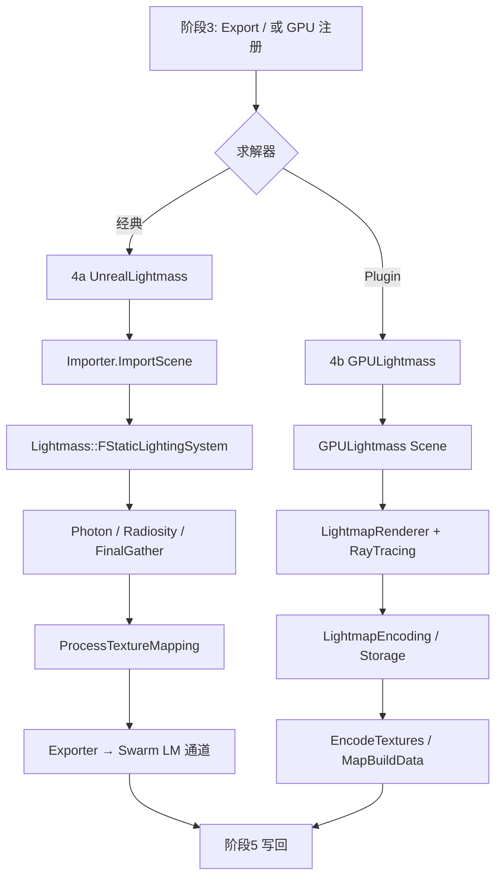

# Phase 4 阅读指南（CPU / GPU 分轨）

目标：弄清阶段 3 导出之后，**光照如何被求解成 Lightmap 数据**。本阶段有两条实现：

| 轨道 | 程序形态 | 输入 | 核心手段 | 输出 |
|------|----------|------|----------|------|
| **4a CPU** | 独立进程 `UnrealLightmass` | Swarm 通道（scene/mesh/…） | Photon + Radiosity + Final Gather，CPU 栅格化到 LM UV | 量化 LM/Shadow 写回 Swarm |
| **4b GPU** | Editor 内 Plugin | 实时场景组件注册 | GPU 路径追踪 Tile + Encode | 直接写入/编码进 LightMap 资源 |

配合 [READ_LIST.md](./READ_LIST.md)；路径相对 `Core/Phase4/`。

---

## 1. 在整条管线中的位置

---

## 2. 4a vs 4b 对照心智模型

| 维度 | 4a CPU UnrealLightmass | 4b GPULightmass |
|------|------------------------|-----------------|
| 谁启动 | Swarm Agent 拉起独立进程 | `FGPULightmassModule` 注册为 `IStaticLightingSystemImpl` |
| 场景从哪来 | 反序列化阶段 3 二进制 | Editor 内 `OnPrimitiveComponentRegistered` 等钩子 |
| 采样域 | CPU 上按 **Lightmap UV** 三角形栅格化 texel | GPU 上按 **Tile** 路径追踪，再编码到 LM |
| 间接光 | Photon Map + Radiosity + Final Gather（可配置） | 路径追踪（+ Irradiance Cache 等） |
| 与 Editor 关系 | 异步、进程隔离；结果经 Swarm 回传 | 同进程；可预览 VT；结束时常直接 `EncodeTextures` |
| 同名陷阱 | 进程内也有 `FStaticLightingSystem` | Editor 侧是另一套 `FStaticLightingSystem`（阶段 3） |

---

## 3. 阅读顺序 — 4a CPU

### Session A1 — 进程与导入

1. `UnrealLightmass.cpp`：`main`、Swarm 连接、任务循环轮廓  
2. `CPUSolver.*`：如何把 Swarm 任务交给 LightingSystem  
3. `LightmassSwarm.*` → `Importer::ImportScene` → `LightmassScene`  
4. 对照 `Public/SceneExport.h` / `MeshExport.h`：你在阶段 3 写出的结构，此处如何读回  

**检查点：** 能说出「一个 Texture Mapping 任务」从 Swarm 到内存对象的路径。

### Session A2 — ProcessTextureMapping 主干

1. `LightingSystem.h`：任务枚举 `StaticLightingTask_*`、`ProcessTextureMapping` 声明  
2. `TextureMapping.cpp`：  
   - `RasterizeToSurfaceCacheTextureMapping`：沿 LM UV 把几何属性打进 texel  
   - `ProcessTextureMapping`：Direct（Filtered / Area / SDF / Photon）→ Indirect  
3. `LightmapData.*`：结果缓冲如何组织  
4. `Exporter.*`：如何把结果写回 Swarm（阶段 5 的输入）

**检查点：** Lightmap UV 在求解端的用途是「**栅格化参数域**」，不是运行时采样（那是阶段 6）。

### Session A3 — 间接光与加速

1. `PhotonMapping.cpp` → `Radiosity.cpp` → `FinalGather.cpp`（先看被 `ProcessTextureMapping` / 任务队列调用的入口）  
2. `MonteCarlo.*`、`GatheredLightingSample.h`、`LightingCache.*`  
3. `Collision.*` / `Embree.*` / `LightingMesh.*`：光线查询  

**检查点：** 能画「Photon 缓存近似 ↔ Final Gather 精炼」的关系；Embree 在何处被 Collision 使用。

### Session A4 —（可选）体积 / BSP / Landscape

仅当需要完整 Lightmass 功能面时再读 P3 文件；**2D StaticMesh Lightmap 主干不依赖它们**。

---

## 4. 阅读顺序 — 4b GPU

### Session B1 — 如何挂上编辑器

1. 共享：`StaticLightingSystemInterface.*`  
2. `GPULightmassModule.cpp`：`RegisterImplementation`  
3. `GPULightmass.h/.cpp`：生命周期、Component/Light 注册、`EditorTick`  
4. `GPULightmassSettings.*`：质量/采样相关旋钮  

**检查点：** 启用 GPULightmass 后，为何可以**不走** UnrealLightmass 进程与 Swarm Scene 导出。

### Session B2 — Tile 渲染管线

1. `Scene/StaticMesh.*`、`Lights.*`、`GeometryInterface.*`：GPU 场景表示  
2. `LightmapTilePool.*`、`LightmapStorage.*`：Tile 调度与存储  
3. `LightmapGBuffer.*` + `LightmapGBuffer.usf`：几何/材质属性进 GBuffer  
4. `LightmapRenderer.*`：`AddRequest` → 渲染 → `Finalize` / `BackgroundTick`  
5. `LightmapRayTracing.*` + `LightmapPathTracing.usf`：路径追踪  

**检查点：** 一次「可见 Tile」从 Request 到 Path Tracing 再到 Storage 的步骤。

### Session B3 — 编码与写回边界

1. `LightmapEncoding.*` + `LightmapEncoding.ush` / `LightmapCommon.ush` / `LightmapOutput.usf`  
2. `LightmapDenoising.*`（可选质量路径）  
3. `Scene.cpp` 中 `FLightMap2D::EncodeTextures` 一带：与阶段 5 的汇合点  

**检查点：** GPU 路径常在 Plugin 内就进入 Encode；CPU 路径则把量化数据先丢回 Swarm，由 Editor `FLightmassProcessor` 导入后再 Encode。

### Session B4 —（可选）IC / 体积 / Editor UI

`IrradianceCaching.*`、`VolumetricLightmap.*`、`GPULightmassEditor` —— 非 2D LM 主链，按需。

---

## 5. 关键符号速查

### 4a CPU

| 符号 | 文件 | 作用 |
|------|------|------|
| `main` | `UnrealLightmass.cpp` | 进程入口 |
| `FLightmassImporter::ImportScene` | `Importer.*` | 读 Swarm 场景 |
| `Lightmass::FStaticLightingSystem` | `LightingSystem.*` | 进程内求解中枢 |
| `ProcessTextureMapping` | `TextureMapping.cpp` | 单张 LM 求解 |
| `RasterizeToSurfaceCacheTextureMapping` | 同上 | LM UV → texel 属性 |
| Photon / Radiosity / FinalGather | 各 `.cpp` | 间接光算法 |
| `FLightmassExporter`（进程内） | `ImportExport/Exporter.*` | 结果写回 Swarm |

### 4b GPU

| 符号 | 文件 | 作用 |
|------|------|------|
| `FGPULightmassModule` | `GPULightmassModule.*` | `IStaticLightingSystemImpl` |
| `FGPULightmass` | `GPULightmass.*` | 世界级求解系统 |
| `FLightmapRenderer` | `LightmapRenderer.*` | Tile 渲染调度 |
| `LightmapPathTracing.usf` | Shaders | GPU 路径追踪 |
| `LightmapEncoding` | Encoding C++/USH | 系数编码 |
| `FLightMap2D::EncodeTextures` | 调用点在 `Scene.cpp` | 汇入引擎 LightMap |

### 共享

| 符号 | 文件 | 作用 |
|------|------|------|
| `RegisterImplementation` | `StaticLightingSystemInterface.*` | 选择 GPU 实现 |

---

## 6. 大文件阅读策略

| 文件 | 策略 |
|------|------|
| `LightingSystem.h/.cpp` | 先任务枚举 + `ProcessTextureMapping` 声明/调用点；算法细节进分文件 |
| `TextureMapping.cpp` | 精读 Rasterize + Process 两段；Direct 各分支扫签名 |
| `FinalGather.cpp` / `PhotonMapping.cpp` | 从对外入口函数往下，勿线性通读 |
| `Scene.cpp`（GPU） | 搜 Lightmap、Encode、Tile、Build |
| `LightmapRenderer.cpp` | 跟 `AddRequest` / `BackgroundTick` / `Finalize` |
| `LightmapPathTracing.usf` | 当「GPU Final Gather」对照 CPU FinalGather 读 |

---

## 7. 读完应能回答的问题

**4a**

1. Swarm Task 完成时，UnrealLightmass 写出的是浮点缓冲还是量化系数？与 `ImportExport.h` 哪几个结构对应？  
2. `ProcessTextureMapping` 里 Direct 与 Indirect 的大致顺序？Photon 何时替代/辅助 Direct？  
3. 为何说进程内 `FStaticLightingSystem` ≠ Editor `FStaticLightingSystem`？

**4b**

4. GPULightmass 如何绕过 Swarm Scene 导出仍能烘 StaticMesh？  
5. Tile Request 与整张 Lightmap 分辨率（阶段 2）如何对应？  
6. 路径追踪结果如何变成与 CPU 路径兼容的 LightMap 系数？

**对照**

7. 两条路径在「沿 Lightmap UV 定义 2D 域」上是否一致？差异主要在采样执行器（CPU 栅格 vs GPU RT）还是在数据契约？  
8. 各自与阶段 5 的衔接点分别在哪一个函数附近？

---

## 8. 与前后阶段的接口

**来自阶段 3**

- 4a：可读的 Swarm 通道（`LM_SCENE` / mesh / material / mapping 任务）  
- 4b：`StaticLightingSystemInterface` 已可注册；场景组件仍由 Editor 提供  

**交给阶段 5**

- 4a：Swarm 上的量化 LightMap/ShadowMap 通道 → Editor `ImportMapping` / `CompleteRun`  
- 4b：往往已调用或即将调用 `EncodeTextures`，写入与 CPU 路径相同的 `FLightMap2D` / MapBuildData 体系  

阶段 6 再按 UV 采样这些资源做着色；本阶段只负责「把光照算进 Lightmap 域」。
