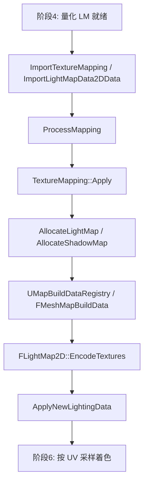

# Phase 5 阅读指南

目标：弄清求解完成后，编辑器如何把**量化 Lightmap / Shadow** 变成持久的 `FMeshMapBuildData`，再 **Encode** 成运行时可绑的贴图与 UV scale/bias。

配合 [READ_LIST.md](./READ_LIST.md)；路径相对 `Core/Phase5/`。

---

## 1. 阶段在整条管线中的位置

**CPU 路径：** Swarm Read → Import → Apply（挂 pending）→ 全局 Encode → ApplyNewLightingData。  
**GPU 路径：** 常在 Plugin 内已 `EncodeTextures`；仍写入同一套 Registry / `FLightMap2D` 体系（汇合点）。

---

## 2. 三条概念线

### A. 导入线（字节 → `FQuantizedLightmapData`）

1. `FinishLightmassProcess` 进入 Import 阶段，调用 `LightmassProcessor->CompleteRun()`
2. `CompleteRun`：`ImportMappings`（及体积/可见性等旁路）
3. `ImportTextureMapping`：从 Swarm Channel 读 `FLightMapData2DData` 头、LightGuids、压缩体素  
4. `ImportLightMapData2DData`：解压填入 `FQuantizedLightmapData`（Scale/Add + 每 texel 系数）
5. `ProcessMapping` → `FStaticLightingSystem::ApplyMapping` → 具体 Mapping 的 `Apply`

对照契约：`UnrealLightmass/Public/ImportExport.h`（阶段 4 Exporter 写出的布局）。

### B. Apply 线（量化数据 → Registry 条目）

以 StaticMesh 为例（`StaticMeshLight.cpp` ≈ 240）：

| 步骤 | 动作 |
|------|------|
| 1 | 确保 `LODData` / `MapBuildDataId` |
| 2 | `LightingContext->GetOrCreateRegistryForActor` |
| 3 | `Registry->AllocateMeshBuildData(MapBuildDataId)` |
| 4 | `FLightMap2D::AllocateLightMap(Registry, QuantizedData, …)` |
| 5 | 非 VT 时 `FShadowMap2D::AllocateShadowMap` |
| 6 | 填充 `IrrelevantLights` |

此时往往只是把量化数据挂到 **pending allocation**（尚未生成最终 atlas 贴图）；真正打成 `UTexture` 在 Encode。

### C. Encode / 收尾线

1. `FStaticLightingSystem::EncodeTextures`  
   → `FLightMap2D::EncodeTextures` + `FShadowMap2D::EncodeTextures`  
2. 把多个 allocation 打包进 LightMap atlas，写出 `ULightMapTexture2D`（或 VT），计算 **CoordinateScaleBias**  
3. `ApplyNewLightingData`：标记 Level 预计算光照有效、BSP 临时元素切换等  
4. 组件重新挂接后，阶段 6 通过 `FMeshMapBuildData` + Uniform 采样

---

## 3. 阅读顺序

### Session 1 — 收尾编排

1. `StaticLightingPrivate.h`：标出 Finish / Encode / Apply 方法  
2. `StaticLightingSystem.cpp`：`FinishLightmassProcess` 整段进度条（Invalidate → CompleteRun → Encode → ApplyNewLightingData）  
3. `Lightmass.h`：Import / Process API 一览  

**检查点：** 能口述「先 Import+Apply 挂数据，再统一 Encode」的顺序及原因（多 Mapping 拼 atlas）。

### Session 2 — Import 一个 Texture Mapping

1. `ImportExport.h`：`FLightMapData2DData`、量化样本字段  
2. `Lightmass.cpp`：`ImportTextureMapping` → `ImportLightMapData2DData`  
3. `ProcessMapping`：如何找到 Helper 并 `ApplyMapping`  

**检查点：** `SizeX/Y` 与阶段 2/3 的 Mapping 分辨率如何 `check` 对齐；Scale/Add 从哪来、Encode 前后谁消费。

### Session 3 — Apply 写入 Registry

1. `MapBuildDataRegistry.h`：通读 `FMeshMapBuildData`  
2. `StaticMeshLight.cpp`：`Apply` 全函数  
3. `StaticLightingBuildContext.cpp`：Registry 选择（Level / Actor / WP）  
4. `MapBuildData.cpp`：`AllocateMeshBuildData` 实现扫读  

**检查点：** `MapBuildDataId` 挂在 Component LOD 上；真正 LightMap 对象 Outer 常是 Registry。

### Session 4 — Encode 与运行时句柄

1. `LightMap.h`：`AllocateLightMap` / `EncodeTextures` / `GetInteraction`  
2. `LightMap.cpp`：`AllocateLightMap`（pending）→ `EncodeTextures`（atlas）  
3. `ShadowMap.*` 对称扫一眼  
4. `LightmapUniformShaderParameters.h`：`LightMapCoordinateScaleBias`  
5. （可选）`LightmapVirtualTexture.*` 与 Apply 里 VT 分支  

**检查点：** 阶段 6 采样的不是「每物体一张原始量化图」，而是 **atlas 贴图 + per-mesh scale/bias**（或 VT 等价物）。

### Session 5 —（可选）体积与 WP

- `ImportVolumetricLightmap.cpp`、`PrecomputedVolumetricLightmap.*`  
- `MapBuildDataActor.*`、`StaticLightingDescriptors.h`  

与 2D Lightmap 主干平行；搞清「另一类写回目标」即可。

---

## 4. 关键符号速查

| 符号 | 文件 | 作用 |
|------|------|------|
| `FinishLightmassProcess` | `StaticLightingSystem.cpp` | 写回总编排 |
| `CompleteRun` | `Lightmass.cpp` | 导入所有完成任务 |
| `ImportTextureMapping` | `Lightmass.cpp` | 读单个 LM 通道 |
| `ImportLightMapData2DData` | `Lightmass.cpp` | 解压量化 texel |
| `ProcessMapping` / `ApplyMapping` | Lightmass / System | 应用到具体 Mapping |
| `FStaticMeshStaticLightingTextureMapping::Apply` | `StaticMeshLight.cpp` | StaticMesh 写 Registry |
| `FMeshMapBuildData` | `MapBuildDataRegistry.h` | 每网格构建数据槽 |
| `AllocateMeshBuildData` | Registry | 分配/覆盖槽位 |
| `FLightMap2D::AllocateLightMap` | `LightMap.*` | 挂起量化分配 |
| `FLightMap2D::EncodeTextures` | `LightMap.*` | 生成最终贴图 |
| `FShadowMap2D::EncodeTextures` | `ShadowMap.*` | 阴影贴图编码 |
| `ApplyNewLightingData` | `StaticLightingSystem.cpp` | 标记构建完成 |
| `LightMapCoordinateScaleBias` | `LightmapUniformShaderParameters.h` | 运行时 UV 变换 |
| `FLightMapData2DData` | `ImportExport.h` | Swarm 侧量化头 |

---

## 5. 大文件阅读策略

| 文件 | 策略 |
|------|------|
| `Lightmass.cpp` | 只跟 CompleteRun / Import* / ProcessMapping |
| `StaticLightingSystem.cpp` | 只跟 Finish / Encode / ApplyNew / ApplyMapping |
| `LightMap.cpp`（很大） | AllocateLightMap + EncodeTextures 两段为主；Interaction 留给阶段 6 |
| `MapBuildData.cpp` | 搜 Allocate / GetMeshBuildData / Serialize |
| `StaticMeshLight.cpp` | 精读 `Apply`；创建 Mapping 部分属阶段 3 |
| `ImportVolumetricLightmap.cpp` | 可选，独立旁路 |

---

## 6. 读完应能回答的问题

1. 为何不在每个 `Apply` 里立刻生成最终 `UTexture2D`，而要集中 `EncodeTextures`？  
2. `FQuantizedLightmapData` 与最终 `ULightMapTexture2D` 生命周期关系？谁在 Encode 后被释放？  
3. `FMeshMapBuildData` 存在 Level 的 Registry 还是 Component 自身？`MapBuildDataId` 起什么作用？  
4. VT Lightmap 开启时，ShadowMap 为何可能并进 LightMap allocation（见 `Apply` 分支）？  
5. GPULightmass 若已调用 `EncodeTextures`，与本 Phase `FinishLightmassProcess` 路径如何避免概念混淆？  
6. `LightMapCoordinateScaleBias` 解决什么问题？与阶段 1 的 Lightmap UV 通道是什么关系？

---

## 7. 与前后阶段的接口

**来自阶段 4**

- CPU：Swarm 上可读的量化 LM/Shadow 通道（布局见 `ImportExport.h`）  
- GPU：同进程内已填充或已 Encode 的 LightMap 数据  

**交给阶段 6**

- `UMapBuildDataRegistry` 中的 `FMeshMapBuildData`（`LightMap` / `ShadowMap` 引用）  
- 编码后的 LightMap 贴图（或 VT）  
- 每网格 **UV scale/bias**（Uniform），供 Vertex Factory / `LightmapCommon.ush` 采样  

阶段 5 **不**负责着色混合；只把构建结果变成运行时可绑定的资源。
