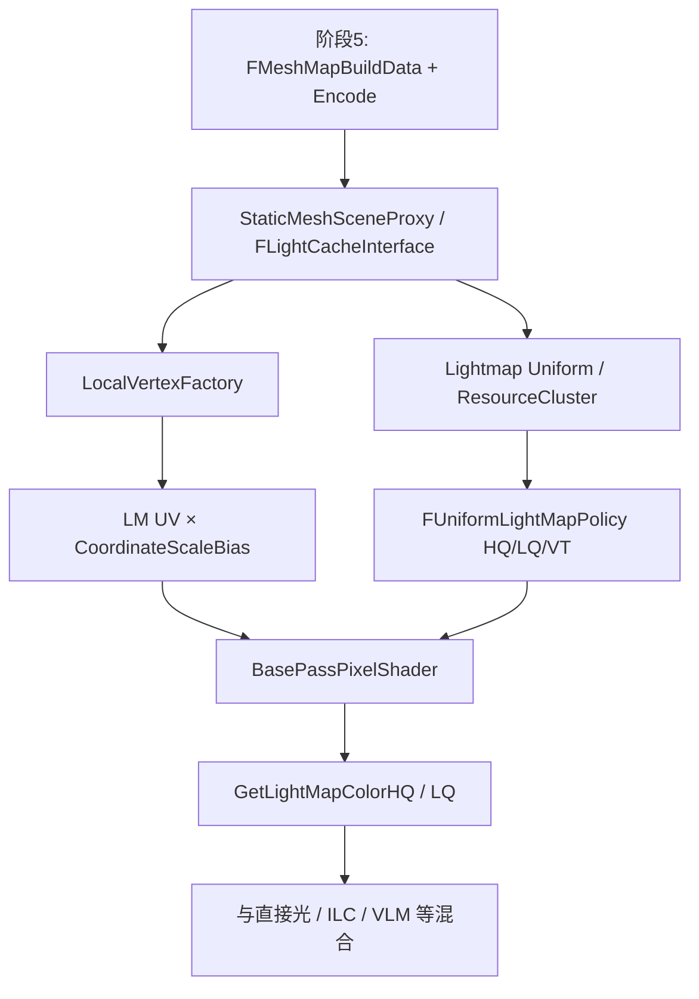

# Phase 6 阅读指南

目标：弄清运行时如何用**阶段 1 的 Lightmap UV** + **阶段 5 的贴图与 scale/bias**，在 BasePass 里采样预计算光照，并与其它光照项混合。

配合 [READ_LIST.md](./READ_LIST.md)；路径相对 `Core/Phase6/`。

---

## 1. 阶段在整条管线中的位置

本阶段**不再**烘培；只消费已写回的构建数据做着色。

---

## 2. 三条概念线

### A. 绑定线（CPU → GPU 参数）

1. Component / LOD 通过 `GetMeshMapBuildData` 拿到 `FMeshMapBuildData`
2. SceneProxy 的 LOD 对象作为 `FLightCacheInterface`，`SetLightMap(MeshBuildData.LightMap)`
3. `FLightMap2D::GetInteraction` 产出 `FLightMapInteraction`（纹理、系数 Scale/Add、**CoordinateScale/Bias**）
4. 填入 Lightmap Uniform / Resource Cluster，供 VF 与像素着色器读取

### B. UV 线（顶点 → 像素）

1. 网格顶点带有阶段 1 写入的 **Lightmap UV 通道**（`LightMapCoordinateIndex`）
2. `LocalVertexFactory.ush` 取出该 attribute（或 VertexFetch）
3. 乘加 atlas 的 `LightMapCoordinateScaleBias`（阶段 5 Encode 时算好）
4. 插值到像素：`MaterialParameters.LightmapUVs` / Policy 使用的 LightmapUV0/1

**注意：** 顶点 UV ∈ [chart 打包域]；scale/bias 把它映射到 **Lightmap atlas 子矩形**（或 VT 等价寻址）。

### C. 采样与混合线（像素）

1. BasePass 按材质/平台选择 `ELightMapPolicyType` → 编译宏 `HQ_TEXTURE_LIGHTMAP` 或 `LQ_TEXTURE_LIGHTMAP` 等  
2. `GetPrecomputedIndirectLightingAndSkyLight` 中调用 `GetLightMapColorHQ` / `LQ`  
3. 得到 `DiffuseIndirectLighting`（及 subsurface 项）  
4. 与直接光照、其它间接源（ILC、Volumetric Lightmap…）按分支组合进最终色  

---

## 3. 阅读顺序

### Session 1 — 运行时拿到什么

1. `MapBuildDataRegistry.h`：复习 `FMeshMapBuildData`  
2. `LightMap.h`：`GetInteraction` 声明与 `FLightMapInteraction`  
3. `LightmapUniformShaderParameters.h`：哪些 float4/纹理会进 shader  
4. `LightMap.cpp`：精读 `GetInteraction`（约 3250）

**检查点：** 能画出「Registry → LightMap2D → Interaction → Uniform」；分清 **系数 Scale/Add**（解码 texel）与 **Coordinate Scale/Bias**（atlas UV）。

### Session 2 — SceneProxy 如何挂上 LightMap

1. `SceneManagement.h`：`FLightCacheInterface` 接口  
2. `StaticMeshSceneProxy.cpp`：LOD 构造 / `GetMeshMapBuildData` / `SetLightMap`  
3. `GetLightMapCoordinateIndex` 与 `StaticMesh.h` 字段对照  

**检查点：** 没有有效 MapBuildData 或 LightMap 时，Policy 会落到 None / 其它间接路径。

### Session 3 — Vertex Factory 变换 UV

1. `LocalVertexFactory.h/.cpp`：coordinate index 如何进 VF 数据  
2. `LocalVertexFactory.ush`：`VertexFactoryGetInterpolantsVSToPS` 中 LightMapCoordinate 段（约 1120–1156）  
3. 对照 Uniform 里的 `LightMapCoordinateScaleBias`

**检查点：** 手算一例：`uv_atlas = uv_mesh * scale.xy + bias.zw`（注意实例覆盖分支）。

### Session 4 — Policy 与 BasePass 采样

1. `LightMapRendering.h`：枚举与 `FUniformLightMapPolicy`  
2. `LightMapRendering.cpp`：`ModifyCompilationEnvironment` 如何定义 HQ/LQ 宏  
3. `BasePassRendering.h`：模板如何把 Policy 嵌进 VS/PS  
4. `BasePassRendering.cpp`：搜绘制路径上 Policy 选择（不必通读全文件）  
5. `LightmapCommon.ush`：`GetLightMapColorHQ` / `LQ`  
6. `BasePassPixelShader.usf`：`GetPrecomputedIndirectLightingAndSkyLight` 的 Lightmap 分支 + 主着色里间接光累加  

**检查点：** HQ 与 LQ 在系数数量/贴图张数上的差异；间接光如何乘 `DiffuseColor` 再与直接光相加。

### Session 5 — Mobile / VT / 调试（可选）

- `MobileBasePassPixelShader.usf`：LQ + DF Shadow 组合  
- `LightmapVirtualTexture.*` + `LIGHTMAP_VT_ENABLED`  
- `LightMapDensity*`：密度可视化如何复用 LM UV  

---

## 4. 关键符号速查

| 符号 | 文件 | 作用 |
|------|------|------|
| `FMeshMapBuildData` | `MapBuildDataRegistry.h` | 运行时 LightMap/ShadowMap 槽 |
| `FLightCacheInterface` | `SceneManagement.h` | Proxy 侧光照缓存接口 |
| `FLightMap2D::GetInteraction` | `LightMap.cpp` | 生成采样描述 |
| `LightMapCoordinateScaleBias` | `LightmapUniformShaderParameters.h` | atlas UV 变换 |
| `LightMapCoordinateIndex` | `StaticMesh.h` / SceneProxy | 哪路顶点 UV |
| `LocalVertexFactory.ush` LM 段 | `LocalVertexFactory.ush` | UV × scale/bias |
| `ELightMapPolicyType` | `LightMapRendering.h` | HQ/LQ/Shadow 组合 |
| `FUniformLightMapPolicy` | `LightMapRendering.*` | BasePass 用的统一 Policy |
| `GetLightMapColorHQ` / `LQ` | `LightmapCommon.ush` | 解码采样 |
| `GetPrecomputedIndirectLightingAndSkyLight` | `BasePassPixelShader.usf` | 预计算间接光入口 |
| `MaterialExpressionLightmapUVs` | 对应 `.h` | 材质可读 LM UV |

---

## 5. 大文件阅读策略

| 文件 | 策略 |
|------|------|
| `BasePassPixelShader.usf` | 先 `LightmapCommon` include → `GetPrecomputedIndirectLightingAndSkyLight` → 主函数里间接光累加两处 |
| `BasePassRendering.cpp` | 搜 `LightMapPolicy` / `UniformLightMap`；勿通读 |
| `StaticMeshSceneProxy.cpp` | 搜 `LightMap` / `MapBuildData` / `FLightCacheInterface` |
| `LightMap.cpp` | 只读 `GetInteraction` 与 Uniform 创建；Encode 属阶段 5 |
| `LocalVertexFactory.ush` | 只精读 LightMapCoordinate 相关块 |
| `SceneManagement.h` | 只读 `FLightCacheInterface` 段 |

---

## 6. 读完应能回答的问题

1. 关闭 `bGenerateLightmapUVs` 但手动画了 UV1，运行时仍能采样吗？依赖什么字段？  
2. 为什么需要 `CoordinateScaleBias`？和 Lightmass 量化里的 Scale/Add 有何不同？  
3. HQ 与 LQ Lightmap 在 shader 宏、贴图数量、法线响应上差在哪里？  
4. 同一像素上 Lightmap 间接光与动态直接光如何共存？BasePass 里大约在哪一步相加？  
5. 没有 LightMap 的移动物体走哪条预计算间接路径（ILC / VLM）？与 Texture Lightmap 分支如何互斥？  
6. VT Lightmap 时，VF 的 UV 变换与 Page Table 采样如何衔接？

---

## 7. 与前面阶段的接口（收束）

| 阶段 | 交给本阶段的契约 |
|------|------------------|
| 1 | 网格上有效的 Lightmap UV 通道；`LightMapCoordinateIndex` |
| 2–3 | 分辨率与 Mapping 决定了 LM 纹素密度（影响观感，不直接改采样代码） |
| 4 | （间接）系数内容 |
| 5 | `FMeshMapBuildData`、编码贴图、**CoordinateScaleBias**、系数 Scale/Add |

全链路至此闭合：**导入展开 UV → 烘培写入 Lightmap → 运行时按 UV 采样并混合着色**。
