```mermaid
flowchart LR
  A[Import FBX/Interchange] --> B[FMeshBuildSettings]
  B --> C[FLayoutUV / CreateLightMapUVLayout]
  C --> D[UStaticMesh.LightMapCoordinateIndex]
  D --> E[FStaticLightingSystem.GatherScene]
  E --> F[FLightmassExporter + Swarm]
  F --> G[UnrealLightmass / GPULightmass]
  G --> H[ImportTextureMapping]
  H --> I[UMapBuildDataRegistry]
  I --> J[LightMapPolicy + LightmapCommon.ush]
```

# UE 5.4 Lightmap 管线代码框架

本目录从 UE 5.4 官方源代码中拷贝与下列流程直接相关的源码，用于进行 Lightmap 管线实现的研究。

---

## 端到端流程

```
导入网格
  →（构建时）展开 / 指定 Lightmap UV
  → 设置烘培与场景参数
  → 收集对象并导出（Swarm）
  → 求解光照（CPU Lightmass / GPULightmass）
  → 写回构建数据（MapBuildData / LightMap）
  →（运行时）按 UV 采样 Lightmap，并与其它光照混合着色
```



---

## 阶段 1 — 导入网格 → 展开 / 指定 Lightmap UV

导入或 StaticMesh 重建时，若 `FMeshBuildSettings::bGenerateLightmapUVs` 为真，从源 UV 通道找 chart、打包到目标 UV 通道（默认 `DstLightmapIndex = 1`）；`UStaticMesh::LightMapCoordinateIndex` 指向该通道供烘培与运行时使用。

| 角色 | 路径 | 关键符号 |
|------|------|---------|
| UV 展开/打包核心 | `Engine/Source/Runtime/MeshUtilitiesCommon/` | `FLayoutUV::FindCharts` / `FindBestPacking`；`FAllocator2D`；`FOverlappingCorners`；`ELightmapUVVersion` |
| MeshDescription 入口 | `Engine/Source/Runtime/StaticMeshDescription/` | `FStaticMeshOperations::CreateLightMapUVLayout` |
| 构建时调用 | `Engine/Source/Developer/MeshBuilder/` | `FMeshDescriptionHelper` → `CreateLightMapUVLayout`；`FStaticMeshBuilder` |
| 旧 RawMesh 路径 | `Engine/Source/Developer/MeshUtilities/Private/MeshUtilities.cpp` | 直接使用 `FLayoutUV` |
| 构建设置 | `Engine/Source/Runtime/Engine/Classes/Engine/EngineTypes.h` | `FMeshBuildSettings`：`bGenerateLightmapUVs`、`Src/DstLightmapIndex`、`MinLightmapResolution` |
| 网格资产字段 | `Engine/Source/Runtime/Engine/Classes/Engine/StaticMesh.h` | `LightMapCoordinateIndex`、`LightMapResolution` |
| FBX 导入 | `Engine/Source/Editor/UnrealEd/.../Fbx*` | `UFbxStaticMeshImportData` / `FbxStaticMeshImport.cpp` |
| Interchange 导入 | `Engine/Plugins/Interchange/Runtime/...` | `InterchangeStaticMeshFactoryNode`、`InterchangeGeneric*MeshPipeline` |

**建议阅读顺序（UV 展开）：**

1. `LayoutUV.h` / `LayoutUV.cpp`
2. `StaticMeshOperations.cpp`（`CreateLightMapUVLayout`、`FLayoutUVMeshDescriptionView`）
3. `MeshDescriptionHelper.cpp`
4. `EngineTypes.h` 中 `FMeshBuildSettings`

---

## 阶段 2 — 设置烘培与场景参数

配置每网格 LM 通道/分辨率、WorldSettings 中 Lightmass 质量、Importance Volume / Primitive Lightmass 覆盖等。

| 角色 | 路径 | 关键符号 |
|------|------|---------|
| 世界 Lightmass 设置 | `.../GameFramework/WorldSettings.h` | `FLightmassWorldInfoSettings`、`LightmassSettings` |
| 体积 / 覆盖 | `.../Classes/Lightmass/` | `ALightmassImportanceVolume`、`ULightmassPrimitiveSettingsObject`、`ALightmassPortal` |
| 静态光照抽象 | `.../Public/StaticLighting.h` | `FStaticLightingMesh` / Mapping（含烘培用 texcoord） |
| 构建上下文 | `StaticLightingBuildContext.h/.cpp` | 构建期场景上下文 |
| 分辨率工具 | `Engine/Source/Editor/LevelEditor/.../LightmapResRatioAdjust.*` | Lightmap 分辨率比例调整 |

---

## 阶段 3 — 收集对象并导出

编辑器 `FStaticLightingSystem` 收集可烘培 Primitive → 用 `LightMapCoordinateIndex` 建 `FStaticLightingMesh` / Texture Mapping → 经 Swarm 导出给 Lightmass（或走 GPULightmass 接口）。

| 角色 | 路径 | 关键符号 |
|------|------|---------|
| 编排中枢 | `.../StaticLightingSystem/StaticLightingSystem.cpp` | `GatherScene`、`BeginLightmassProcess`、`ApplyNewLightingData` |
| 导出 | `StaticLightingExport.cpp`、`StaticLightingTextureMapping.cpp` | 场景/贴图映射导出 |
| Lightmass 桥 | `.../Lightmass/Lightmass.h/.cpp` | `FLightmassExporter`、`FLightmassProcessor` |
| 材质烘焙给 Lightmass | `LightmassRender.h/.cpp` | 材质属性栅格化 |
| StaticMesh → Mapping | `.../StaticMeshLight.cpp` | 从 LM UV 索引创建映射 |
| 可插拔求解器 | `StaticLightingSystemInterface.h/.cpp` | GPULightmass 注册入口 |
| Swarm 通道 | `Engine/Source/Editor/SwarmInterface/` | `FSwarmInterface` |
| 导出契约 | `Engine/Source/Programs/UnrealLightmass/Public/` | `ImportExport.h`、`SceneExport.h`、`MeshExport.h`、`LightmassPublic.h` |

---

## 阶段 4 — 求解光照

### 4a CPU UnrealLightmass

导入场景 → Photon / Radiosity / Final Gather → 沿 Lightmap UV 栅格化到 lightmap → 经 Swarm 回传量化数据。

| 角色 | 路径 |
|------|------|
| 导入/导出 | `.../UnrealLightmass/Private/ImportExport/`（`Importer`、`Exporter`、`LightmassScene`、`LightmassSwarm`、`Mesh`） |
| 求解主循环 | `.../Lighting/LightingSystem.*`、`Lighting.h` |
| Texture Mapping / LM 数据 | `TextureMapping.cpp`、`Mappings.*`、`LightmapData.*` |
| 光照算法 | `FinalGather.cpp`、`PhotonMapping.cpp`、`Radiosity.cpp`、`MonteCarlo.*` |
| 加速结构 | `Collision.*`、`Embree.*`、`LightingMesh.*` |

### 4b GPULightmass

实现 `IStaticLightingSystem`；GPU 路径追踪 lightmap tile；编码进同一套运行时 LightMap 存储。

| 角色 | 路径 |
|------|------|
| 模块 / 设置 | `Plugins/Experimental/GPULightmass/.../GPULightmass*`、`GPULightmassSettings.*` |
| 场景 | `.../Private/Scene/Scene.*`、`StaticMesh.*`、`Lights.*` |
| 渲染 / RT / 编码 | `LightmapRenderer.*`、`LightmapRayTracing.*`、`LightmapEncoding.*`、`LightmapStorage.*` |
| 着色器 | `.../Shaders/Private/LightmapPathTracing.usf`、`LightmapEncoding.ush`、`LightmapCommon.ush` |

---

## 阶段 5 — 写回构建数据

编辑器导入量化 LM（`ImportTextureMapping` / `ImportLightMapData2DData`）→ 编码贴图 → 将 `FMeshMapBuildData`（LightMap + ShadowMap + UV scale/bias）写入 `UMapBuildDataRegistry`。

| 角色 | 路径 | 关键符号 |
|------|------|---------|
| 导入写回 | `Lightmass.cpp`、`StaticLightingSystem.cpp` | `ImportMappings`、`EncodeTextures`、`ApplyNewLightingData` |
| LightMap 资源 | `Engine/Source/Runtime/Engine/Public/LightMap.h`、`Private/LightMap.cpp` | `FLightMap2D` |
| Map 构建数据 | `MapBuildDataRegistry.h`、`MapBuildData.cpp` | `FMeshMapBuildData` |
| ShadowMap | `ShadowMap.h/.cpp` | 静态阴影贴图 |
| 贴图类型 / Uniform | `LightMapTexture2D.h`、`LightmapUniformShaderParameters.*` | 运行时绑定参数 |
| 虚拟纹理 LM | `VT/LightmapVirtualTexture.*` | VT lightmap |

---

## 阶段 6 — 运行时按 UV 采样并混合着色

Vertex Factory 读取 LM UV → 应用 atlas scale/bias → BasePass 选择 `FUniformLightMapPolicy`（HQ/LQ/VT/None）→ `LightmapCommon.ush` 采样解码 → 与其它直接/间接光混合。

| 角色 | 路径 | 关键符号 |
|------|------|---------|
| Policy | `Renderer/Private/LightMapRendering.h/.cpp` | `ELightMapPolicyType`、`FUniformLightMapPolicy` |
| BasePass | `BasePassRendering.h/.cpp` | 绑定 LightMap policy |
| SceneProxy | `StaticMeshSceneProxy.cpp` | 从 MapBuildData 绑定 LM |
| VF | `LocalVertexFactory.h/.cpp`、`Shaders/Private/LocalVertexFactory.ush` | LM UV 属性 / scale-bias |
| 采样 | `Shaders/Private/LightmapCommon.ush`、`LightmapData.ush` | `GetLightMapColorHQ` / `LQ` |
| 像素着色 | `BasePassPixelShader.usf`、`MobileBasePassPixelShader.usf` | `#include LightmapCommon.ush` |
| 材质节点 | `Materials/MaterialExpressionLightmapUVs.h` | 暴露 Lightmap UV |
| 调试 | `LightMapDensityShader.usf`、`LightMapHelpers.*` | 密度可视化 |

---

## 目录枢纽

| 枢纽 | 作用 |
|------|------|
| `Engine/Source/Runtime/MeshUtilitiesCommon` | Lightmap UV 展开/打包核心 |
| `Engine/Source/Runtime/StaticMeshDescription` | `CreateLightMapUVLayout` |
| `Engine/Source/Developer/MeshBuilder` + `MeshUtilities` | 构建期触发 UV 生成 |
| `Engine/Source/Editor/UnrealEd/Private/StaticLightingSystem` | 收集场景、启动构建、应用结果 |
| `Engine/Source/Editor/UnrealEd/Private/Lightmass` | Swarm ↔ Lightmass 导出/导入 |
| `Engine/Source/Editor/SwarmInterface` | 分布式任务通道 |
| `Engine/Source/Programs/UnrealLightmass` | CPU Lightmass 求解进程 |
| `Engine/Plugins/Experimental/GPULightmass` | GPU 路径追踪求解器 |
| `Engine/Source/Runtime/Engine`（LightMap / MapBuildData / StaticLighting） | 构建数据与运行时资源 |
| `Engine/Source/Runtime/Renderer` + `Engine/Shaders/Private` | LightMapPolicy + 采样着色 |

---

## 未收录部分说明（降噪）

本框架优先研究 **UV 展开** 与 **Lightmap 烘焙**，以下相关但非主干内容未引入：

- Landscape / BSP / Fluid 专用 Lightmass 路径
- Volumetric Lightmap、预计算可见性（Precomputed Visibility）全套
- World Partition 静态光照 Actor 周边
- Swarm DotNET 客户端工程、GPULightmass Editor UI 细节
- Lumen / 动态 GI、无关 Renderer/Shader 大目录
- Explore 中整模块镜像（大量无关 Developer 模块）

---
